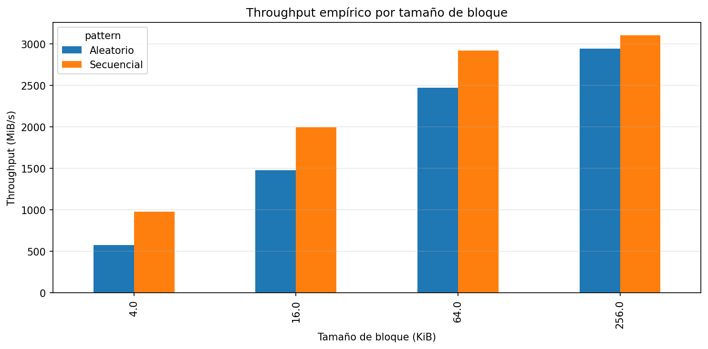
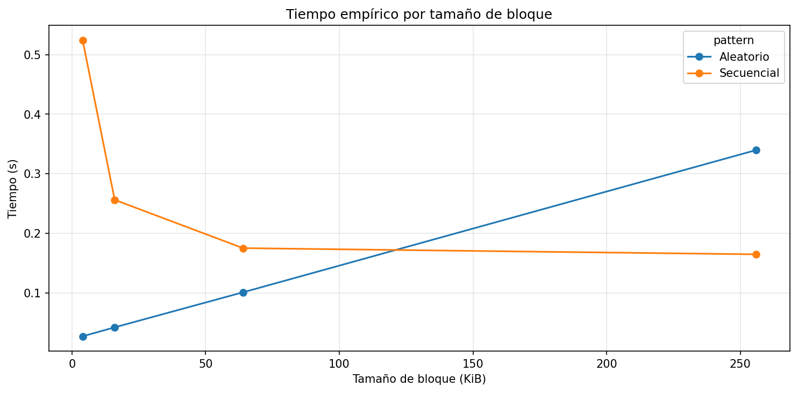
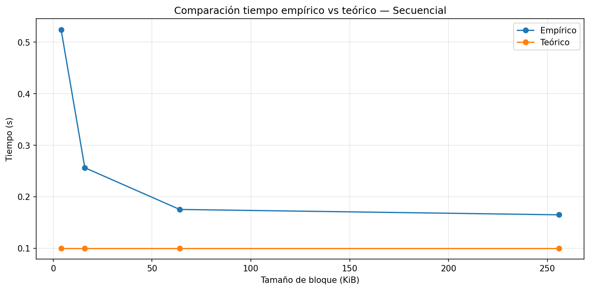
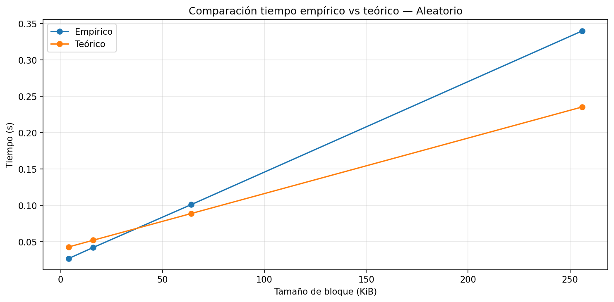
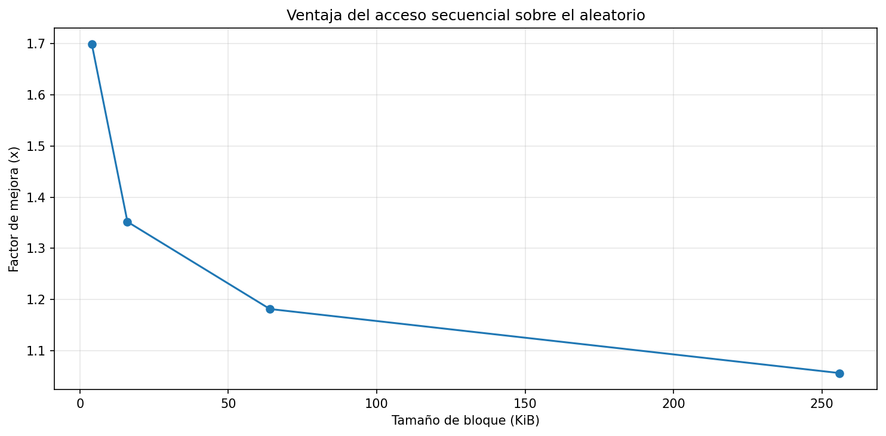

# Lab 3 — I/O Performance

## 1. Especificaciones del equipo

| Parámetro | Valor observado |
|----------|----------------|
| Sistema Operativo | Fedora Linux 43 (Workstation Edition) |
| CPU | Intel(R) Core(TM) i7-9750HF CPU @ 2.60GHz |
| Arquitectura y Núcleos | x86_64 / 12 CPUs (6 núcleos físicos aprox.) |
| Memoria RAM Total | 16 GB |
| Tecnología de Almacenamiento | SSD NVMe (Samsung SSD 970 EVO Plus 500GB) |
| Carga de CPU en Reposo (%) | ~6% |

---

## 2. Resultados del experimento

### Throughput por tamaño de bloque

### Tiempo empírico por tamaño de bloque

### Tiempo teoría vs práctica — Secuencial

### Tiempo teoría vs práctica — Aleatorio

### Ventaja del acceso secuencial

---

## 3. Análisis y conclusiones

### Comparación de patrones

En mi equipo, el acceso secuencial fue entre **1.05x y 1.7x más rápido** que el acceso aleatorio, dependiendo del tamaño del bloque. La mayor diferencia se observó con bloques de **4 KB**, donde el speedup fue aproximadamente **1.7x**, mientras que con bloques grandes como 256 KB la diferencia disminuye a cerca de **1.05x**.

Este resultado es consistente con la teoría, ya que el acceso secuencial reduce la cantidad de operaciones de I/O y aprovecha mejor el ancho de banda del disco.

---

### Efecto del tamaño de bloque

El throughput del acceso aleatorio **aumentó a medida que creció el tamaño del bloque**. Por ejemplo, pasó de aproximadamente **574 MiB/s con 4 KB** a cerca de **2942 MiB/s con 256 KB**.

Esto ocurre porque bloques más grandes permiten transferir más datos por operación, reduciendo el impacto de la latencia.

---

### Teoría vs práctica

Se observa una diferencia importante en el acceso secuencial con bloques de **4 KB**, donde el tiempo empírico fue de aproximadamente **0.52 s**, mientras que el modelo teórico estimaba cerca de **0.10 s**.

Esto indica que el modelo teórico **subestima el tiempo real**, especialmente en bloques pequeños. Esta diferencia puede explicarse por factores como la **caché del sistema operativo**, el **overhead de llamadas al sistema** y las **optimizaciones del hardware (SSD)**.

---

### Tipo de disco

Según los resultados obtenidos, especialmente los valores de throughput que alcanzan hasta **~3000 MiB/s**, mi equipo se comporta como un **SSD NVMe**.

---

### Aplicación práctica

Si tuviera que manejar una tabla de estudiantes con 1 millón de registros, preferiría realizar una lectura **secuencial**.

Esto se debe a que el acceso secuencial permite aprovechar mejor el rendimiento del disco, mientras que el acceso aleatorio introduce múltiples operaciones pequeñas que incrementan la latencia.

---

## 4. Conclusión

En este laboratorio se evidenció que la forma en que se accede a los datos en disco tiene un impacto directo en el rendimiento. Los resultados muestran que el acceso secuencial es más eficiente que el aleatorio, especialmente con bloques pequeños. Por ejemplo, con bloques de **4 KB**, el acceso secuencial alcanzó aproximadamente **976 MiB/s**, mientras que el aleatorio fue de **574 MiB/s**, mostrando una mejora de alrededor de **1.7x**.

Aunque esta diferencia disminuye al aumentar el tamaño del bloque, sigue siendo relevante. Esto se debe a que el acceso secuencial permite leer datos de forma continua, mientras que el acceso aleatorio implica múltiples operaciones independientes.

El modelo teórico logró capturar la tendencia general, pero en algunos casos subestimó el tiempo real debido a factores como la caché del sistema operativo y las optimizaciones del hardware.

Finalmente, estos resultados sugieren que, en sistemas reales como bases de datos, es fundamental organizar los datos para favorecer accesos secuenciales y el uso de bloques grandes, con el fin de reducir el costo de I/O y mejorar el rendimiento.

---

## 5. Anotración ante la entrega

El archivo "dataset.bin" de la carpeta "/io_lab_data" no se carga en la presente entrega.